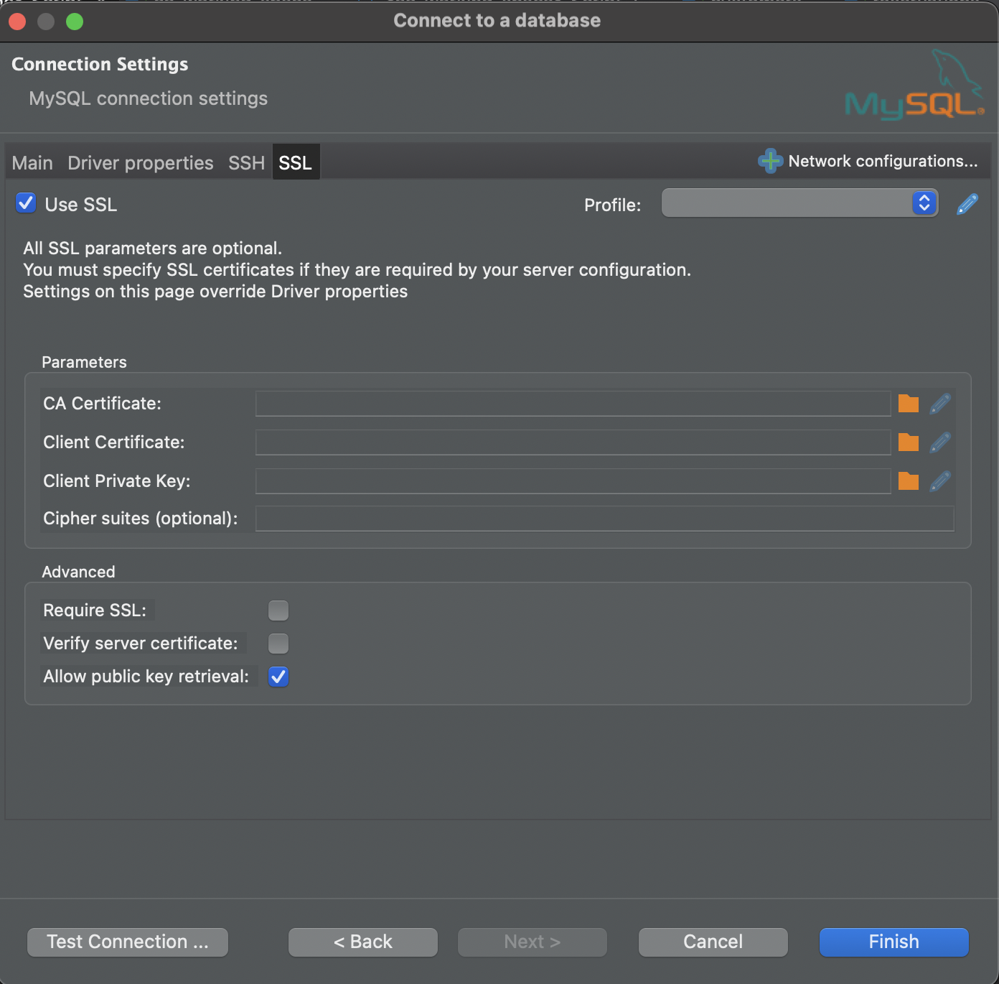

# Co-working space management system

### Step by step to run the project locally

1. Clone the project
2. run `npm install`
3. run `docker compose up -d` (make sure to have docker installed)
4. connect to mysql database using mysql workbench or any other database IDE

   - database: **co-working-space**
   - user: **root**
   - password: **myrootpassword**
     However, you may encounter the same problem as me (I use Dbeaver in my case) that you can't connect the database even the information are filled,

   **_you may need to setup some SSL_**
   

5. paste and run the sql script from the file `/scripts/sql_stater.sql` to setup the tables and mock data.
6. run `npm run dev` to start the server
